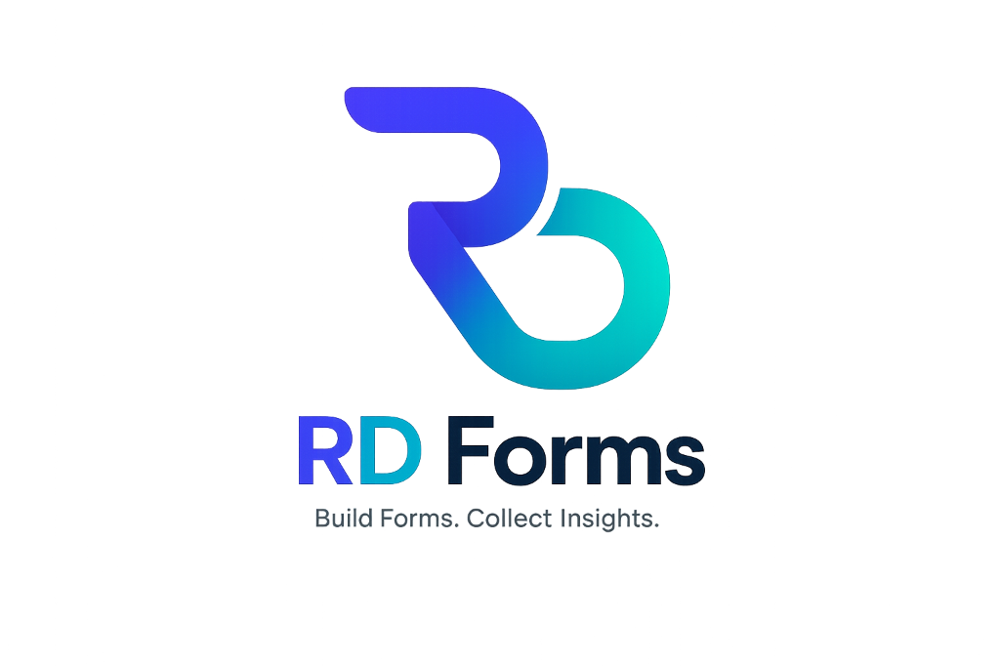

# RD Forms 📋

**Build forms that actually get filled.**

RD Forms is a full-stack, dynamic form builder built from the ground up for modern SaaS workflows. It allows users to create professional forms using a drag-and-drop interface, share them instantly via links or QR codes, and track responses and completion rates in real-time.



---

## 🚀 Features

### Core Functionality
- **Drag & Drop Form Builder:** Intuitively build forms using `@dnd-kit` with reorderable fields.
- **Multiple Field Types:** Supports Text, Email, Phone, Number, Textarea, Select, Checkbox, Radio, Date, Rating, and pre-built blocks (Address, Contact).
- **Real-Time Preview:** Toggle seamlessly between Edit mode and Live Preview.
- **Form Publishing:** Drafts save automatically. Publish to generate a shareable public link.
- **QR Code Generation:** Instantly generate and download QR codes for any published form.

### Responses & Analytics
- **Workspace Analytics:** Top-level dashboard showing total views, total submissions, and average completion rates across all your forms.
- **Individual Form Insights:** Drill down into specific forms to view their unique KPIs (views vs. submissions).
- **Response Management:** View all submitted data in a clean, paginated data table.
- **CSV Export:** Download all responses for a form (or high-level workspace analytics) directly into a `.csv` file.

### Platform & Architecture
- **Authentication:** Secure JWT-based authentication system with hashed passwords.
- **Theming System:** Fully custom CSS variable-based theming supporting Light ("ocean-blue") and Dark ("midnight-dark") modes.
- **Command Palette:** Quick-action keyboard shortcuts (`Ctrl/Cmd + K`) for power users.
- **Responsive Design:** A mobile-first approach ensuring the builder and public forms look flawless on any device.

---

## 🛠️ Tech Stack

This project uses a standard MERN-like stack, swapping standard React for Vite for significantly faster HMR and builds.

### Frontend (Client)
- **Framework:** React 18
- **Build Tool:** Vite
- **Routing:** React Router v6
- **Drag & Drop:** `@dnd-kit` (Core, Sortable, Utilities)
- **QR Codes:** `qrcode.react`
- **Styling:** Vanilla CSS with custom CSS variables (No Tailwind)
- **State Management:** React Context API (`AuthContext`, `ThemeContext`)

### Backend (Server)
- **Runtime:** Node.js
- **Framework:** Express.js
- **Database:** MongoDB
- **ORM/ODM:** Mongoose
- **Authentication:** `jsonwebtoken` (JWT) & `bcryptjs`
- **Validation:** `zod`
- **ID Generation:** `nanoid` (for generating unique share links)

---

## 📂 Project Structure

```text
.
├── client/                     # Frontend Vite + React application
│   ├── public/                 # Static assets (favicon, logo)
│   ├── src/
│   │   ├── api/                # Axios/Fetch wrappers for backend communication
│   │   ├── assets/             # Internal assets and images
│   │   ├── components/         # Reusable UI components (Sidebar, CommandPalette, etc.)
│   │   ├── context/            # Global React contexts (Auth, Theme)
│   │   ├── hooks/              # Custom React hooks (useToast)
│   │   ├── pages/              # Primary route views (Dashboard, FormBuilder, Analytics, etc.)
│   │   ├── utils/              # Helper functions (CSV download, initials generator)
│   │   ├── App.jsx             # Main application router
│   │   └── index.css           # Global design system & theme variables
│   ├── index.html              # Entry HTML file
│   └── package.json
│
└── server/                     # Backend Express API
    ├── src/
    │   ├── controllers/        # Route logic (auth, form, response)
    │   ├── middleware/         # Custom middlewares (JWT auth verification)
    │   ├── models/             # Mongoose schemas (User, Form, Response)
    │   ├── routes/             # Express API routing definitions
    │   ├── utils/              # Backend utilities (JWT signing)
    │   └── app.js              # Express server entry point
    ├── .env.example
    └── package.json
```

---

## ⚙️ Environment Variables

To run this project, you will need to add the following environment variables to your respective `.env` files.

### Server (`server/.env`)

```env
# The port your backend server will run on (default: 5000)
PORT=5000

# Your MongoDB connection string
MONGO_URI=mongodb+srv://<username>:<password>@cluster0.mongodb.net/rd-forms?retryWrites=true&w=majority

# Secret key for signing JSON Web Tokens
JWT_SECRET=supersecretjwtkey_changeme_in_production

# The URL of your frontend application (for CORS)
CLIENT_URL=http://localhost:5173
```

### Client (`client/.env`)

```env
# The URL pointing to your backend API
VITE_API_URL=http://localhost:5000/api
```

---

## 💻 Running Locally

### 1. Clone the repository
```bash
git clone https://github.com/devagyarai/RD-Forms.git
cd RD-Forms
```

### 2. Setup the Server
```bash
cd server
npm install

# Rename .env.example to .env and fill in your credentials
# Start the development server (uses nodemon)
npm run dev
```

### 3. Setup the Client
Open a new terminal window:
```bash
cd client
npm install

# Start the Vite development server
npm run dev
```

The client will be available at `http://localhost:5173`.

---

## 🏗️ Build Instructions

To build the frontend for production:

```bash
cd client
npm run build
```
This will generate an optimized, minified bundle in the `client/dist` directory.

---

## 🔮 Future Improvements

While RD Forms is fully functional, there are several areas planned for future iterations:
- **Email Notifications:** Triggering emails upon new form submissions.
- **Webhooks:** Sending submission payloads to external URLs (e.g., Zapier, Make).
- **Conditional Logic:** Showing or hiding fields based on previous answers.
- **File Uploads:** Allowing users to upload documents or images via forms.
- **Custom Thank You Pages:** Redirecting users after submission.

---

## ⚠️ Known Limitations

- **File Uploads:** Currently, the builder does not support file/image upload fields natively.
- **Multi-step Forms:** Forms are currently rendered on a single page, regardless of length.

---

## 📄 License

This project is licensed under the MIT License.
